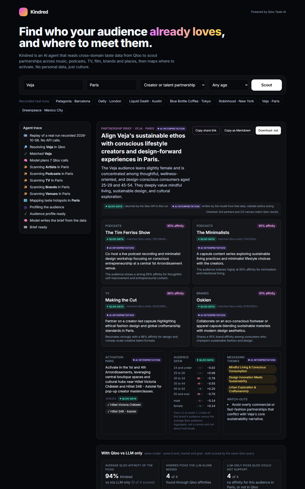

# Kindred

**Find who your audience already loves, and where to meet them.**

Kindred is an AI agent for partnership and sponsorship teams at brands, clubs, promoters and agencies. Give it a subject (a brand, an artist, a team, a festival or a venue), a market city and a goal. It uses **Qloo Taste AI** to read the cultural affinities of that audience across music, podcasts, TV, film, brands and places, maps where that audience concentrates in the city, and writes a partnership or sponsorship brief in which every partner and venue is checked against Qloo results from that run. Direct competitors are kept out using Qloo's own brand tags, and the brief says which ones were skipped and why.

Live demo: https://kindred-taste.vercel.app (no login). Built for the Qloo Agentic Hackathon. MIT licence.



## The problem

Partnerships, sponsorships and pop-ups are usually picked by gut feeling, by whoever is famous, or by slow survey panels. Ask a general-purpose LLM and you get plausible names it has seen often, with no evidence that this brand's audience actually cares about them. Kindred answers three questions with aggregate taste data instead: who this audience over-indexes on, how strongly, and where in the city it concentrates. It takes about a minute.

## Who uses it: a worked case

**Persona.** Marta is the partnerships manager for an outdoor apparel brand's southern Europe team. Each quarter she brings two or three partner ideas and one activation neighbourhood per city to a planning meeting, and she has to show why this audience would care. Today that means desk research, social listening exports and, when budget allows, a survey panel.

**The decision.** Patagonia, Barcelona, goal "brand partnership or co-branded collab": which partners go on the shortlist, which do not, and where in the city to activate. (Recorded example: `/?example=patagonia-barcelona`.)

**What Kindred gives her in about a minute.**
- Partners: GoPro (Qloo affinity 96%), Backpacker Magazine (96%) and Down to Earth with Zac Efron (95%), each tied to a Qloo entity id from that run.
- Kept off the list, with Qloo's reason: The North Face and Arc'teryx (Qloo lists them as Patagonia competitors), Fjällräven and Icebreaker (Qloo lists Patagonia as theirs).
- Where: l'Eixample and Gràcia (Qloo heatmap hotspots), with venues such as Yurbban Passage Hotel & Spa.
- A check on the obvious shortcut: the same model without Qloo suggested Nomada Studio, Casa Bonay, Ricardo Cavolo and El Extraordinario. 3 of those 4 have no Qloo support for this audience in Barcelona, and in the city-only check 1 of 4 shows up in Qloo's Barcelona data against 3 of 3 of Kindred's picks.

**What she decides.** GoPro and Backpacker Magazine go to the meeting as the shortlist, with the downloaded trace as evidence; l'Eixample is the pop-up area. The model-only ideas are not discarded as bad, but they are labelled as unsupported hypotheses rather than audience insight. Kindred does not decide fit, availability, price or brand safety: she still checks those.

**Time, estimated.** These are our estimates for one brand and one city, not measurements with users.

| Step | Manual research (estimate) | With Kindred (estimate) |
|---|---|---|
| Cross-domain affinities of the audience | 4-8 h of desk research and social listening (or a 2-4 week survey panel) | about 1 min, one agent run |
| Remove direct competitors | 30-60 min | automatic, each with Qloo's reason |
| Where in the city | 1-2 h with maps and local knowledge | included (heatmap hotspots and venues) |
| Evidence for the deck | 1-2 h | Markdown brief and request trace, downloaded |
| Review and judgement | included above | 30-60 min |
| **Total** | **roughly 1-1.5 working days** | **under 1 hour** |

## With Qloo vs LLM only

Every brief can be compared with what the same model says without Qloo. For the same subject, market and goal, the model answers in one call with no tools and no data. Then Qloo checks both answers. Misses are reported as such, never imputed.

**The plain finding.** Across 10 recorded runs (October 2026, model `gemini-flash-lite-latest`), 29 of the model's 40 picks had no Qloo support for the audience in that city: Qloo returned no affinity for them, or its search did not find them at all.

**The city check, which is not circular.** Kindred picks partners from the audience's Qloo affinities, so scoring both columns with that same audience query favours Kindred by design. The city check avoids that: it asks Qloo whether each pick appears in its data for the city at all, sending only the city (`signal.location.query`) and never the subject's audience. All 32 of Kindred's partners appear in Qloo's data for their city; 11 of the model's 40 picks do, and 10 are not in Qloo at all.

| Subject · market (goal) | LLM-only picks with no Qloo support | In Qloo's city data, city signal only: Kindred · LLM only | Kindred picks the LLM alone missed | Avg audience affinity: Kindred · LLM only (scored) |
|---|---|---|---|---|
| Patagonia · Barcelona (brand partnership or co-branded collab) | 3 of 4 | 3 of 3 · 1 of 4 | 3 of 3 | 95% · 85% (1 of 4) |
| Oatly · London (pop-up activation) | 3 of 4 | 4 of 4 · 1 of 4 | 4 of 4 | 97% · 85% (1 of 4) |
| Liquid Death · Austin (music or event sponsorship) | 3 of 4 | 3 of 3 · 1 of 4 | 3 of 3 | 94% · 86% (1 of 4) |
| Blue Bottle Coffee · Tokyo (pop-up activation) | 3 of 4 | 3 of 3 · 1 of 4 | 3 of 3 | 96% · 88% (1 of 4) |
| Robinhood · New York (podcast or media sponsorship) | 3 of 4 | 3 of 3 · 1 of 4 | 3 of 3 | 94% · 69% (1 of 4) |
| Veja · Paris (creator or talent partnership) | 4 of 4 | 3 of 3 · 0 of 4 | 3 of 3 | 92% · n/a (0 of 4) |
| Greenpeace · Mexico City (music or event sponsorship, 35 and younger) | 2 of 4 | 3 of 3 · 2 of 4 | 3 of 3 | 94% · 88% (2 of 4) |
| Los Angeles Dodgers · Los Angeles (sponsors for an artist, team or event) | 1 of 4 | 3 of 3 · 3 of 4 | 3 of 3 | 94% · 89% (3 of 4) |
| Bad Bunny · Miami (sponsors for an artist, team or event) | 3 of 4 | 4 of 4 · 1 of 4 | 4 of 4 | 95% · 89% (1 of 4) |
| Coachella Music Festival · Los Angeles (sponsors for an artist, team or event) | 4 of 4 | 3 of 3 · 0 of 4 | 3 of 3 | 95% · n/a (0 of 4) |

None of Kindred's 32 partners was named by the model alone. The affinity averages (last column) are kept for reference only, for the reason above: Kindred's partners come from the top of that same ranking. What the table shows is that a model on its own does not know these affinities: its picks are often local and plausible but unsupported, though not everywhere: for the Dodgers only 1 of the model's 4 picks lacks Qloo support. Five runs were re-recorded on 6 October 2026 with the competitor filter, and the city check was added to the first seven the same day from their stored picks; the Dodgers, Bad Bunny and Coachella runs were recorded that day too, with the agent that accepts artists, teams and festivals as the subject. None of the ten briefs contains a direct competitor. The comparison runs live too (button under any live brief), within the same rate limits.

## How it works

```
subject, market, goal ─► server resolves the subject in Qloo (/search; a brand, team or festival is a brand entity, an artist is not)
                    ─► LLM agent with tool calling (Gemini, OpenAI-compatible API)
                          get_affinities        /v2/insights  filter.type=urn:entity:{artist|podcast|tv_show|brand|place|...}
                          get_heatmap           /v2/insights  filter.type=urn:heatmap
                          get_audience_profile  /v2/insights  filter.type=urn:demographics
                          (brand results: direct competitors withheld by Qloo brand tags)
                    ─► submit_brief (structured JSON)
                    ─► server check: every partner and venue matched to a Qloo result of this run;
                       a rival proposed as a partner is sent back to the model once, removed if it stays
                    ─► brief · LLM-only comparison · taste graph · activation map · trace
```

Why these Qloo calls fit the problem:

- **Entity resolution** (`/search`) pins the subject to a Qloo entity id. The id, not the name, is the signal for everything else. Teams, clubs and festivals are `brand` entities; an artist comes back as `person` and `artist` with the same name, and Kindred queries the `artist`. A brand search for an artist returns look-alikes (Bad Bunny finds "Skinny Bunny Tea"), so the brand search is only accepted when one of its results carries the name that was asked for, and the search without a type decides otherwise.
- **Cross-domain affinities** (`/v2/insights`, `signal.interests.entities=<brand id>`, one call per domain, localized with `signal.location.query`) answer "who does this audience over-index on" in music, podcasts, TV, brands and more. This is the part an LLM cannot know.
- **Places** (`filter.type=urn:entity:place`, `filter.location.query`) give concrete venues in the market city.
- **Heatmap** (`filter.type=urn:heatmap`) shows where in the city the audience concentrates; hotspots get neighbourhood names from OpenStreetMap.
- **Demographics** (`filter.type=urn:demographics`) gives the audience's age and gender skew.
- **Candidate scoring** (`filter.results.entities`) asks Qloo for the affinity of specific entities, which is how the LLM-only picks are measured on the same scale. With only `signal.location.query` as the signal, the same filter becomes the city check of both columns.
- **Brand tags** (`competitor_brand`, `similar_brand`, `industry`, `product_category` on brand entities; `category` on places) decide what a direct competitor is. Affinity is not complementarity: co-affinity is strongest inside a category, so for Patagonia in Barcelona the top brands were The North Face (98%), Arc'teryx (96%) and Fjällräven (96%), all rivals. A candidate is skipped when Qloo lists it as the brand's competitor or the brand as its competitor; when both share a Qloo industry and product category (Illy for Blue Bottle Coffee: Food & Beverage, Coffee); when Qloo tags it as a similar brand and the products overlap (Voodoo Ranger for Liquid Death: Hard Tea and Iced Tea); or, for a place, when its category is the brand's own business (a coffee shop for a café chain). Complementary brands stay: Oatly keeps Moving Mountains (plant-based meat), Patagonia keeps GoPro.

The agent decides which domains fit the goal and fires the calls in parallel; a throttle keeps at most 3 Qloo requests in flight and retries 429s with bounded backoff. The brief can only be submitted after real affinity data has been gathered.

**Affinity is not popularity.** Qloo returns two numbers for every entity: affinity (how strongly this audience over-indexes on it) and popularity (how widely known it is overall). Kindred reads them together and labels partners and taste-graph cards. **Safe bet**: popularity 0.97 or more, broad reach on top of high affinity (GoPro for Patagonia, popularity 0.999). **Hidden gem**: popularity below 0.9 and below the median of that domain's results, a discovery play the audience already loves (Oddbox for Oatly in London, popularity 0.63). The label is our own calculation on Qloo's `affinity` and `popularity`, not a Qloo metric; an entity with no popularity value gets none, and rivals that were skipped get none.

## Provenance and limits in the product

- Every block of the brief is labelled **Qloo data** (partner affinities, venues, heatmap, taste graph, audience skew) or **AI interpretation** (headline, concepts, plan, themes, watch-outs).
- The server matches each partner and venue the model wrote to a Qloo result from the same run. Displayed affinities are always Qloo's; if the model misquoted a number, both are shown. Unmatched names are flagged as unverified.
- **Skipped as direct competitors** lists the rivals withheld from the model, with their affinity and the Qloo-tag reason; the taste graph marks them. If the model still proposes a rival, the server rejects the draft once with the reason ("proposed by the model, removed by the server check" if it persists). The prompt carries the same rule as a backup for rivals that Qloo's tags miss.
- **How this brief was built** (collapsible) shows the redacted request-to-result trace: inputs, each model turn, every Qloo request with entity ids, result names and counts, the server check and the LLM-only scoring. It also shows how credentials and data are handled and what the brief does not establish. The trace can be downloaded as JSON.

### Request-to-result example (redacted)

Patagonia, Barcelona, "Brand partnership or co-branded collab", recorded run of 6 October 2026. The API key is sent only from the server in a request header and never appears in traces, recordings or logs.

```
1. GET /search?query=Patagonia&types=urn:entity:brand&take=5
   -> Patagonia (DB4CE34E-3A63-4947-946F-9D52502C5762), Cerveza Patagonia (0AADEF2D-...)
   Entity choice: the first result, the outdoor brand; the beer brand is ignored.
2. Model turn 1 chooses 7 tools in parallel: get_affinities x5 (podcast, artist, tv_show, brand, place), get_heatmap, get_audience_profile
3. GET /v2/insights?filter.type=urn:entity:podcast&signal.interests.entities=DB4CE34E-...&take=8&signal.location.query=Barcelona
   -> The Rich Roll Podcast (C752CB19-..., affinity 0.975), The Tim Ferriss Show (0.966), ...
   GET /v2/insights?filter.type=urn:entity:tv_show&... -> Down to Earth with Zac Efron (0.949), Anthony Bourdain: Parts Unknown (0.943), ...
   GET /v2/insights?filter.type=urn:entity:brand&...   -> The North Face (0.976), Arc'teryx (0.960), Fjällräven (0.959), GoPro (0.958), ...
      competitor filter (Qloo brand tags): The North Face and Arc'teryx are listed as Patagonia competitors;
      Fjällräven, Icebreaker and Huckberry list Patagonia as theirs. All five are withheld from the model.
   GET /v2/insights?filter.type=urn:entity:place&...&filter.location.query=Barcelona -> Hotel Catalonia Magdalenes (0.829), ...
   GET /v2/insights?filter.type=urn:heatmap&filter.location.query=Barcelona&... -> 1,301 cells; hotspots l'Eixample, Gràcia
   GET /v2/insights?filter.type=urn:demographics&... -> age and gender skew
4. Model turn 2 submits the brief: partners GoPro, Backpacker Magazine, Down to Earth with Zac Efron;
   venues Murmuri Residence Concepció, Yurbban Passage Hotel & Spa
5. Server check: 3/3 partners and 2/2 venues matched to Qloo results; no competitor proposed.
6. LLM only (same model, no tools): Nomada Studio, Casa Bonay, Ricardo Cavolo, El Extraordinario.
   GET /v2/insights?filter.type=urn:entity:brand&...&signal.location.query=Barcelona&filter.results.entities=AF49B6D7-... -> Nomada Studio 0.853
   GET /v2/insights?filter.type=urn:entity:artist&...&filter.results.entities=EB54CADB-... -> no affinity returned for Barcelona
   Casa Bonay and El Extraordinario: not found in Qloo.
7. City check of both columns (only the city as signal, no brand audience):
   GET /v2/insights?filter.type=urn:entity:brand&filter.results.entities=AF49B6D7-...,3381E64E-...,7A016C85-...&signal.location.query=Barcelona -> 3 of 3 present
   GET /v2/insights?filter.type=urn:entity:artist&filter.results.entities=EB54CADB-...&signal.location.query=Barcelona -> 0 of 1 present
   Kindred 3 of 3 in Qloo's Barcelona data; LLM only 1 of 4 (Casa Bonay and El Extraordinario are not in Qloo).
```

## Demo resilience

- **Recorded real runs** of ten subjects in nine cities (outdoor apparel in Barcelona, plant-based food in London, beverages in Austin, specialty coffee in Tokyo, fintech in New York, sneakers in Paris, a nonprofit in Mexico City with an under-35 audience, a baseball team and a music festival in Los Angeles, and an artist in Miami). They replay the exact event stream, including the LLM-only comparison, with no API calls. Each is 20-40 KB. Direct links: `/?example=patagonia-barcelona`, `/?example=blue-bottle-tokyo`, and so on (slugs in `public/examples/index.json`).
- **Share links without storage.** "Copy share link" puts the whole brief, compressed, in the URL fragment (`/#b=...`, about 7 KB). Browsers never send the fragment to a server, nothing is stored, and the link reopens the brief even when quotas run out. Opened links are sanitized (known shapes only, no remote images) and labelled as snapshots.
- **Friendly limits.** When Qloo, the model or the demo limit says "not now", the UI explains it and offers the recorded runs and a retry.

## Setup from a clean environment

Requirements: Node.js 20 or newer and git. There are no npm dependencies.

```bash
git clone https://github.com/eiieval/kindred.git
cd kindred
npm test                 # offline checks, no keys needed (synthetic data)
MOCK=1 npm run dev       # full UI with synthetic data at http://localhost:3000
```

With real data:

```bash
cp .env.example .env     # set QLOO_API_KEY (event-issued) and GEMINI_API_KEY; QLOO_BASE_URL defaults to https://hackathon.api.qloo.com
npm run selftest         # checks Qloo and model access; prints shapes, never secrets
npm run dev              # http://localhost:3000
npm run examples         # re-records public/examples (options: -- --only=slug,slug  -- --baseline-only)
```

Any OpenAI-compatible endpoint works instead of Gemini: set `LLM_BASE_URL`, `LLM_API_KEY` and `LLM_MODEL`. Styles are compiled with `npm run build:css` (Tailwind CLI via npx, build time only).

Deploy: Vercel, with `QLOO_API_KEY` and `GEMINI_API_KEY` as environment variables (see `vercel.json`).

## Known limitations (what a brief does not establish)

- Qloo affinities are aggregate: how much the audience of a brand over-indexes on an entity versus the average Qloo audience. They are not statements about any individual, not causal, and not a forecast that a partnership will work.
- Only the top results per domain are retrieved. An entity missing from a brief is not evidence of low affinity. "No affinity returned" in the comparison means Qloo gave no score for that entity with this audience and market, nothing more.
- Audience skews are relative indices, not a census, and must not drive decisions about people.
- Concepts, headlines, plans and themes are written by the model. They can be wrong or unsuitable: check rights, availability and brand fit before acting.
- The competitor filter is only as complete as Qloo's brand tags. A rival that Qloo does not tag as a competitor, a similar brand or the same category can slip through (the prompt rule is the backup), and a stockist that shares a category can be skipped. Venues are not filtered: they are where the audience goes, which for a coffee brand may well be other cafés. Brand entities can also be ambiguous in Qloo: the "Veja" entity used in the Paris example carries the Brazilian news magazine's tags, so its audience skews Brazilian.
- Entity matching between names and Qloo entities is deliberately conservative; a correct partner written with an unusual spelling can show as unverified.
- Neighbourhood names come from OpenStreetMap reverse geocoding of heatmap cells and can be approximate.
- Recorded examples and share links reflect Qloo data on the day they were made. A share link can be edited by whoever shares it; re-run the brief to confirm.
- The live demo shares one event-issued Qloo key and a free model tier, so the limits are per instance (in memory), not global. What carries the demo under load: the ten recorded runs (no API calls), a cacheable `GET /api/brief` (CDN `s-maxage`, keyed only on the four allow-listed inputs, errors never cached), an in-memory cache and single-flight per instance so identical briefs run once, and `/api/health` (5-minute cached). `node scripts/warm.js` pre-warms 28 subject/city pairs.

## Data handling and security

- Kindred sends Qloo only the subject's name (a brand, artist, team, festival or venue), a city and an optional age band. It collects no personal data, has no accounts and stores no briefs on a server.
- Keys live only in server-side environment variables. Upstream error bodies go to server logs with secrets redacted; users see generic messages.
- Strict Content-Security-Policy with no third-party scripts or fonts: Tailwind is compiled at build time, Leaflet and the Inter font are self-hosted with recorded hashes (`public/vendor`).
- The agent and brief endpoints enforce input allow-lists, a same-origin check, a per-IP rate limit and a concurrency cap. User fields are treated as data in prompts, and all model output is HTML-escaped before rendering.
- `npm test` covers these guarantees offline, plus the provenance checks, the comparison logic, share links and the size and content of every recording.

## Credits

Taste data by [Qloo](https://www.qloo.com). Maps and neighbourhood names © OpenStreetMap contributors. Inter typeface by The Inter Project Authors (SIL Open Font License 1.1). Brand names in the examples are used for illustration only; no affiliation is implied.

## License

MIT
